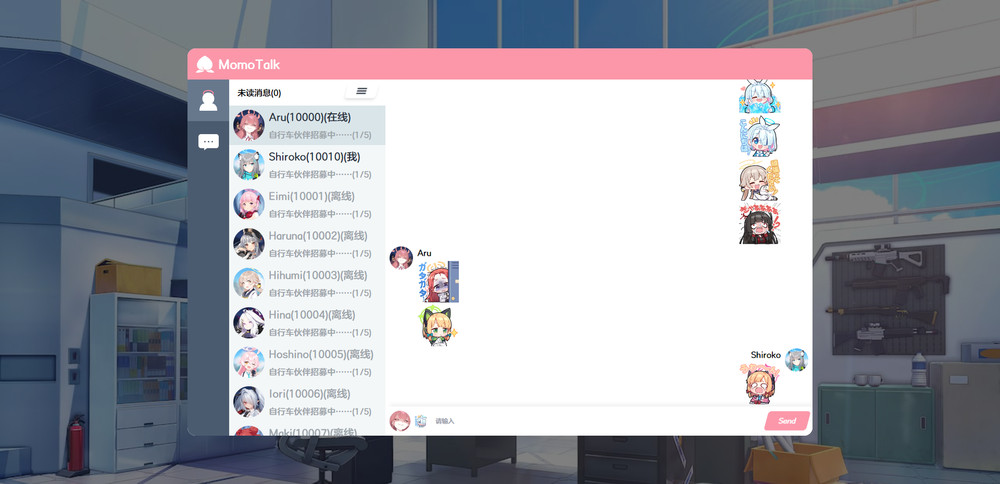
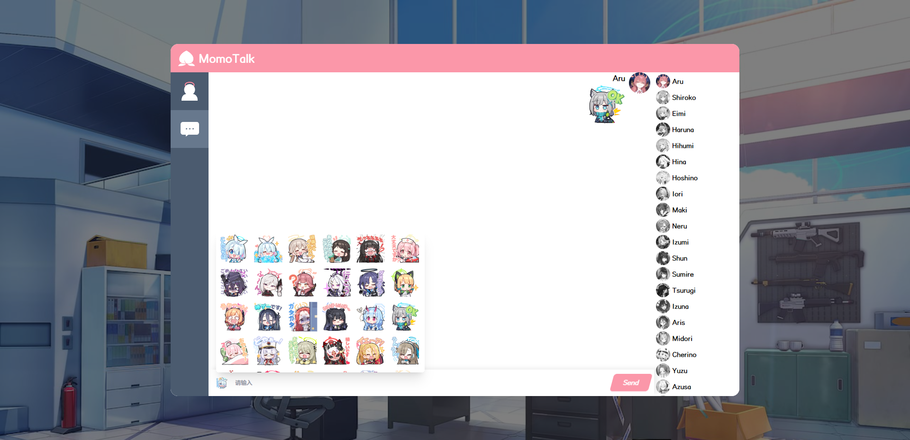
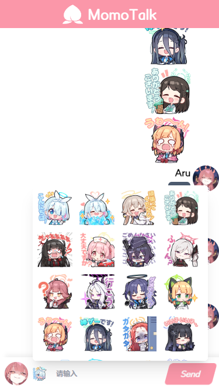

# MomoTalk-Like-Chat

Please forgiving my poor English.

# Preview

# Features

- one to one chat
- group chat
- send stamp
- unread message count

# TODO

- load group history chat

# Start

1. npm install

2. npm run dev

3. you should also run the server side

# Credits

The project is based on vite template [TheSwordBreaker/vite-reactts-eslint-prettier](https://github.com/TheSwordBreaker/vite-reactts-eslint-prettier)

Characters metadata from:

- [https://github.com/lonqie/SchaleDB](https://github.com/lonqie/SchaleDB) / [https://schale.gg/](https://schale.gg/)

# Copyright
